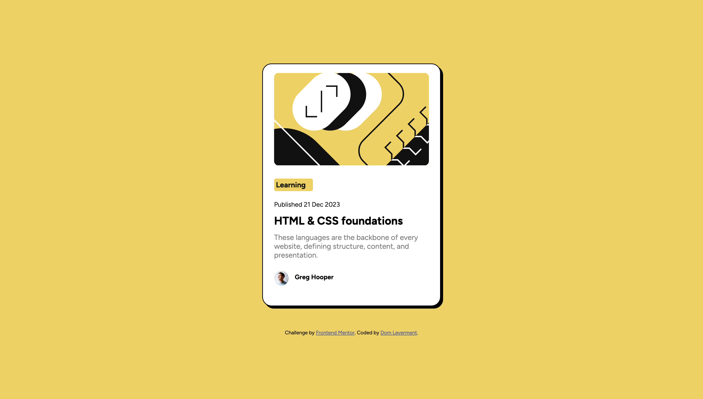

# Frontend Mentor - Blog preview card solution

This is a solution to the [Blog preview card challenge on Frontend Mentor](https://www.frontendmentor.io/challenges/blog-preview-card-ckPaj01IcS). Frontend Mentor challenges help you improve your coding skills by building realistic projects. 

## Overview
Practising HTML and CSS through creating this blog post container.

### The challenge

Users should be able to:

- See hover and focus states for all interactive elements on the page

### Screenshot

)

### Links

- Solution URL: [Add solution URL here](https://your-solution-url.com)
- Live Site URL: [Add live site URL here](https://your-live-site-url.com)

## My process
- built out html
- built out css classes
- researched css classes when i got stuck and asked GPT sometimes to help me debug

### Built with

- Semantic HTML5 markup
- CSS custom properties
- Flexbox
- ChatGPT

### What I learned

That i still need more practice with css layout

### Continued development

I'll continue on in the learning path and try and get more of an understanding of css grid next time. I will also continue practicing css in general as i find that more difficult than setting up the the html structure

**Note: Delete this note and the content within this section and replace with your own plans for continued development.**

## Author

- Frontend Mentor - [@domleverment](https://www.frontendmentor.io/profile/DomLeverment)
- Linkedin: https://www.linkedin.com/in/dom-leverment-1262a175/
